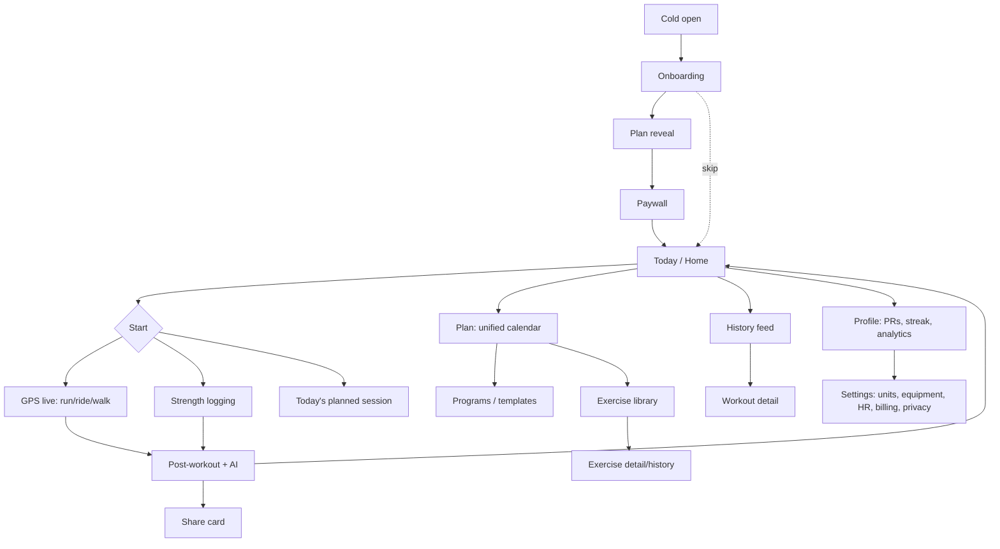
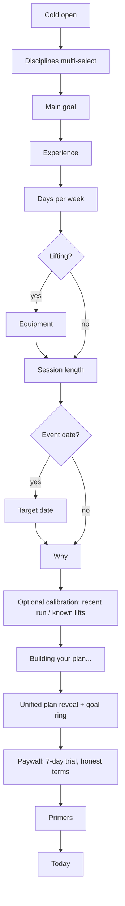
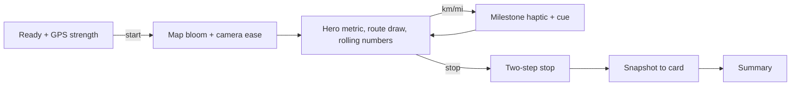
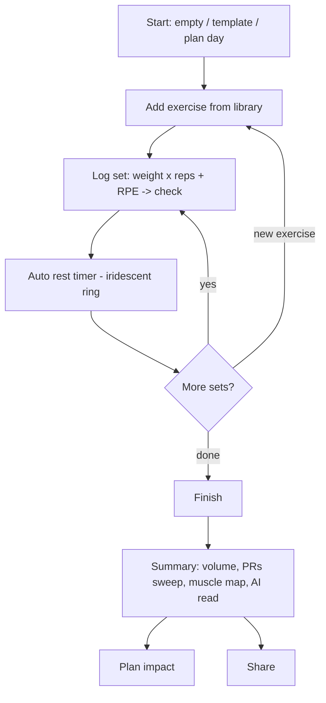
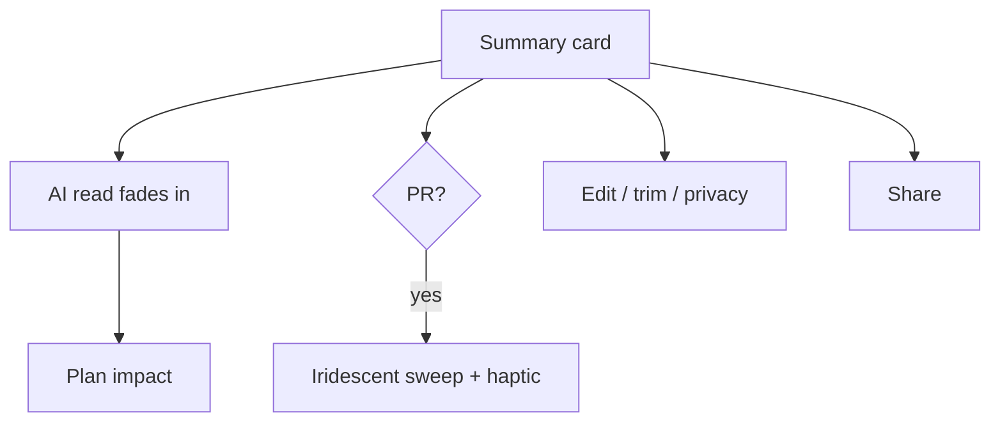
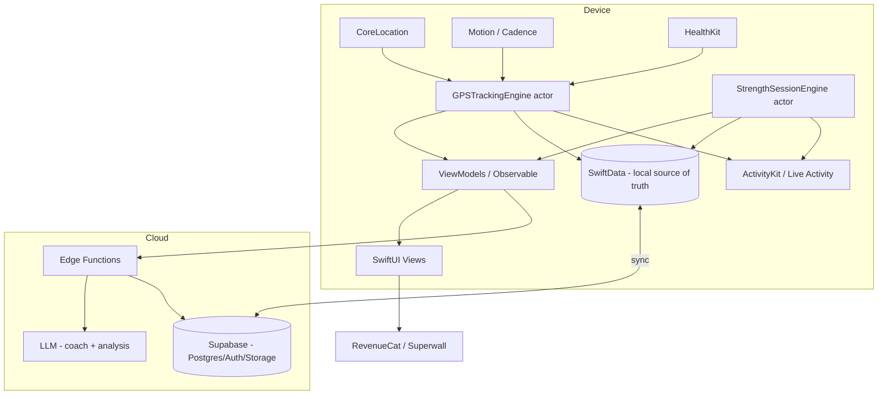

# momentum

**Product Requirements Document · v3.1 — Enterprise build spec**
**iOS-first · SwiftUI · 100% Apple-native · monochrome + iridescent · "The Cal AI of fitness."**

> **v3.0 — the big shift.** momentum is no longer a running app. It is a **personalized, multi-discipline fitness app** — track **runs, rides, walks, and strength** in one beautiful place, with an AI that learns you and builds adaptive plans across all of them. **Social is deliberately deferred** (this is a personal goals-and-tracking app first). Aesthetic: clean monochrome (the white-and-black, minimal-mark feel of premium sports-fuel packaging) with **subtle iridescent gradients** used as an *earned* accent for progress and achievement. Carries forward v2.x's running engine, motion system, native-MapKit decision, and build-ready detail — now generalized.
>
> Changelog: v2.0 research + motion + flows + build spec · v2.1 native MapKit + pace units · v2.2 renamed cadence→momentum · **v3.0 multi-discipline (run/ride/walk/strength), unified Workout model, iridescent design language, multi-discipline adaptive coaching incl. strength programming, enterprise non-functional spec.** · v3.1 added **Part II — build-ready implementation details** (engineering conventions + project structure, design tokens as code, units/formatters, HR-zone model, exact cardio splits/PR/streak rules, strength specifics incl. plate-calc, Live Activity contracts, notifications, share rendering, onboarding mapping, and the unified Supabase DDL) plus minor data-model clarifications. "cadence" now appears only as a *metric* (running steps/min, cycling rpm).

---

## 0. North star

> **momentum** is the most beautiful way to train — whatever training means for you. One calm, premium app that tracks your runs, rides, walks, and lifts, understands you, and gives you a plan that adapts to the life you actually live. It makes progress *visible* and consistency *feel inevitable*.

**The bet.** The fitness-app world is fragmented and ugly. Strava owns multi-sport but is cluttered and social-first. Runna owns running plans; Hevy/Strong own lift logging; Fitbod owns AI lifting — each a silo. The fastest-growing athlete is the **hybrid** one (runs *and* lifts) who today juggles two or three apps that don't talk to each other or look good doing it. Cal AI proved that a beautifully designed, AI-native reimagining can take a "solved" category. momentum is that reimagining for *all* of training: one premium home for every workout, with a coach that sees the whole picture.

**One-liner:** *keep moving.* (momentum is what training becomes when every session builds on the last — a body in motion that stays in motion. The name is the promise.)

**Platform:** iOS 17+, SwiftUI, fully Apple-native (no third-party map or UI SDKs). Apple Watch is a fast-follow and long-term essential.

---

## 1. Strategy & positioning

### 1.1 Thesis
Win on **taste + intelligence + breadth, without the bloat.** Three moves:
1. **One beautiful app for all training.** Cardio *and* strength, unified — not a running app with a lift tab bolted on, and not a lift logger that can't track a run. A single timeline, a single coach, a single aesthetic.
2. **It learns you and tells you what to do.** Adaptive, plain-language plans across disciplines that recalculate around your real performance and life — never a punishing "failed workout."
3. **Monochrome calm, iridescent reward.** A clean black-and-white canvas (the premium, minimal feel of high-end sports-fuel packaging) where the *only* color is a subtle iridescent sheen that appears when you progress or hit a milestone. Color means something.

### 1.2 Competitive landscape
**Cardio / multi-sport**
- **Strava** — the incumbent graph; multi-sport but cluttered, social-first, resented monetization, training tools feel bolted on.
- **Runna** (Strava-owned) — excellent adaptive running plans, flat design, billing-friction complaints.
- **Nike Run Club / Apple Fitness / Garmin Connect** — free/native or hardware-bound; generic, no cross-discipline intelligence, weak shareables.

**Strength**
- **Hevy / Strong** — clean, beloved *loggers*; strong on history/PRs/templates, light on true AI programming and zero cardio.
- **Fitbod** — AI-generated lifting workouts; good engine, utilitarian design, lifting-only.
- **Jefit / Boostcamp / Caliber / Ladder** — programs/coaching, varied polish, lifting-only.

**All-in-one attempts**
- **Apple Fitness, Garmin, Whoop** — Apple/Garmin are broad but generic and hardware-led; Whoop is recovery-only. None is a *beautiful, AI-personalized, do-everything* tracker.

**The gap momentum owns:** there is **no premium, AI-personalized, multi-discipline tracker that handles cardio *and* strength elegantly in one place.** The hybrid athlete is stranded between Strava and Hevy. momentum is the obvious, beautiful home for both.

### 1.3 Differentiation — the 5 pillars
1. **All of training, unified.** Run, ride, walk, lift — one model, one timeline, one coach.
2. **It feels expensive.** Smooth tracking, animated map, rolling numbers, milestone haptics, Live Activity; and for lifting, the fastest, calmest set-logging on iOS.
3. **A coach that sees the whole athlete.** Cross-discipline plans that respect recovery (won't stack a brutal leg day before your long run), explained in plain language.
4. **Monochrome calm, iridescent reward.** Color is earned: rings, PRs, streaks, plan reveals shimmer with subtle iridescence on a pristine B/W base.
5. **Momentum as identity.** Consistency made visible and compounding — streaks, building weeks, a body of work you can watch grow.

### 1.4 Target users
- **Primary — the hybrid athlete.** Runs *and* lifts (or rides + lifts). Currently juggling Strava + Hevy/Fitbod. Wants one beautiful app and a coach that balances both. The wedge.
- **The aspiring/get-fit user (Cal AI buyer).** Wants to look and feel better; will do whatever the app guides — some lifting, some cardio. High willingness to pay for a plan + accountability. Volume + conversion.
- **The lifter.** Wants clean logging + progressive overload + smart programming, but beautiful. (Hevy/Fitbod refugees.)
- **The runner / the walker.** Single-discipline users who get a best-in-class experience and may expand.

### 1.5 What users value most (researched) — and how momentum wins
*Synthesized from UX research and reviews of Strava, Runna, NRC (cardio) and Hevy, Strong, Fitbod (strength), plus fitness-habit research. Ranked by impact on adoption + retention.*

| # | What users value | Evidence | How momentum wins |
|---|---|---|---|
| **1** | **Tracking you trust** | Cardio: GPS accuracy is the #1 priority and #1 complaint. Strength: fast, frictionless set logging with your *previous* numbers in front of you. | GPS engine (§8.3) is our top cardio investment; the strength logger (§8.4) shows last-session loads inline, auto-starts rest timers, and logs a set in one tap. |
| **2** | **Tell me what to do *today*** | Across both worlds, people want a plan that prescribes today's session, not a dashboard — and that **recalculates around life instead of punishing misses**. | Unified "Today" card across disciplines; adaptive engine that moves/rescales with no shame (§4.7, §9). |
| **3** | **Visible progress / progressive overload** | Strength lives or dies on seeing strength go up (e1RM, rep PRs, volume); cardio on pace/distance trends. | Per-exercise and per-discipline trends, e1RM curves, PR detection, muscle-volume analytics, consistency heatmap (§4.8). |
| **4** | **Clarity, not overload** | Both audiences drown in data without a filter for "did today help?" | One hero metric live; a one-sentence AI read post-workout; depth one tap away, never in your face. |
| **5** | **Identity & habit** | Habits beat motivation; identity + accountability + visible streaks drive consistency (balanced with recovery). | Shame-free streaks (rest-day grace), building-weeks, weekly check-in, identity-forward copy, iridescent reward moments. |
| **6** | **A beautiful, frictionless UI** | Bloated/over-changed UIs (Strava) drive churn; logging friction kills lifting apps. | The monochrome-premium thesis; the lowest-friction logger and tracker on iOS. |
| **7** | **Reliability & honest billing** | Runna's top detractors: bugs, slow sync, hard-to-cancel subs. | Durable offline-first capture, rock-solid sync, transparent trial + one-tap cancel + renewal reminders. |
| **8** | **A great exercise library** | Lifters judge a strength app by exercise coverage, search, instructions, and custom-exercise support. | Curated library with muscles/equipment/variations, history per exercise, custom exercises, clean search (§4.5). |
| **9** | **Watch & ecosystem** | Serious users want on-wrist control and Health integration. | Watch app (v1) for cardio *and* strength; full HealthKit read/write (§8.6). |
| **10** | **Recovery awareness** | Hybrid athletes risk overtraining when apps don't coordinate. | Cross-discipline scheduling that spaces hard efforts and inserts deloads (§9). |

**Strategic read:** items 1–4 are where products are won; the incumbents are weakest on *unified experience*. Item 10 (recovery-aware cross-discipline planning) is a capability **no competitor has**, because none own both worlds.

---

## 2. The magic moments
Five connected moments. If these feel magical, momentum wins.

1. **Choosing to train.** Open the app → a calm "Today" card tells you exactly what's on (a run, a lift, a rest). One tap starts it. No clutter, no feed.
2. **The cardio live experience.** Tap start → the map blooms into muted monochrome, the camera eases down, numbers roll, the route draws behind a breathing dot, each mile lands with a haptic. Calm, premium, pocketable (Live Activity).
3. **The strength live experience.** Start a workout → your last session's numbers are right there; tap to log a set; the rest timer spins up automatically with a soft iridescent ring; plate math is done for you. The fastest, quietest logging on iOS.
4. **The finish + the read.** Numbers settle into a framed card; a short human **AI breakdown** tells you what it noticed and where you stand in your plan; a PR sweeps the card with an iridescent shimmer; one tap to a beautiful share card.
5. **Watching it compound.** Streaks, building weeks, e1RM curves climbing, a consistency grid filling — progress made visible, rewarded in iridescence. The feeling that you're becoming someone.

**Activation = first completed workout (any discipline) with the AI read viewed.** Optimize relentlessly.

---

## 3. Product scope

### 3.1 MVP (v0) — the unified core
Small but complete across disciplines. Do each better than anyone.
- **Onboarding + unified plan reveal** (multi-discipline) → soft paywall + trial.
- **Activity chooser**: run · ride · walk · strength.
- **GPS tracking** (run/ride/walk): live monochrome map, discipline-correct metrics (pace vs speed), cadence (steps/rpm), optional HR, auto-pause, audio + haptic cues, Live Activity, GPS-strength indicator.
- **Strength logging**: start empty or from a template/plan day; exercise library; set logging (weight×reps, RPE/RIR, set types); auto rest timer; supersets; plate calculator; inline previous-performance; finish summary (volume, sets, PRs, muscles).
- **Post-workout summary + AI read** (per type) + PR detection + edit.
- **Adaptive coaching (basic)**: generate a unified weekly plan from goals/disciplines/equipment/experience; mark sessions against the plan; no-shame adaptation; "Today" card.
- **History / profile**: mixed activity feed, cross-discipline PRs, streak (done right), volume, muscle-group balance, consistency heatmap.
- **Share cards**: monochrome with iridescent accents; one tap.
- **Monetization**: RevenueCat + Superwall; free tracking, Pro coach/analytics; honest billing.
- **Design system**: monochrome + iridescent, full motion spec.

### 3.2 v1
- **Apple Watch app** — GPS workouts *and* on-wrist strength logging (sets/reps/rest). The credibility unlock for serious users.
- **Voice coach** (guided audio sessions, cadence metronome, premium TTS).
- **Richer analytics** — training load, recovery readiness, trend forecasting, balance insights.
- **Programs marketplace** — curated multi-week programs (running + strength + hybrid).
- **Music** — Apple Music / Spotify now-playing + tempo matching.
- **More disciplines** — rowing, HIIT/circuits, yoga/mobility, swim (pool).

### 3.3 Vision / later
- **Social-lite** (opt-in, tasteful, "you vs your past self" framing) — *the deferred layer*, added only once the personal experience is loved.
- Race-day mode + periodization; seasonal challenges; coaching marketplace (human coaches); Android (only after iOS is undeniable).

### 3.4 Explicit non-goals (focus)
- **No social network at launch** — no feed, following, kudos, or leaderboards in v0. (Deferred, not abandoned.)
- **Not** every sport at launch — run/ride/walk/strength only.
- **Not** Android/web/non-Apple wearables at launch.
- **Not** a nutrition/calorie tracker (HealthKit can surface energy; full food logging is out of scope).
- **Not** a medical or rehab product — no diagnoses, no medical claims.

---

## 4. Feature specifications

### 4.1 Onboarding & unified plan reveal (the conversion engine)
The most important flow for revenue. Cal AI structure, generalized to multi-discipline.

1. **Cold open** — full-bleed monochrome hero with a single drifting iridescent sheen behind the wordmark "momentum," one line ("keep moving."), one button.
2. **Question sequence** (one per screen, tappable cards, progress bar, springy transitions):
   - *What do you want to do?* (multi-select) → Run · Ride · Walk · Lift weights · Get generally fit
   - *What's your main goal?* → Get fit / lose fat · Build muscle · Get stronger · Run a distance (5K–marathon) · Improve endurance · Stay consistent
   - *Experience level* (per chosen discipline, lightweight) → New · Some · Experienced
   - *How many days a week can you train?* → 2 / 3 / 4 / 5 / 6+
   - *Equipment you have* (if lifting) → Full gym · Dumbbells only · Home minimal · Bodyweight
   - *Session length* → 30 / 45 / 60 / 75+ min
   - *Target date?* (if a race/event)
   - *Why?* (clear head / health / look better / compete / me-time) → sets coach tone
   - Optional calibration: a recent run effort and/or a known lift (e.g., bench/squat for X reps) to seed paces and loads (§9). Skippable → calibrates from first sessions.
3. **"Building your plan…"** — a 2–4s animated moment (iridescent threads weaving a week into place). Builds perceived value. *Do not skip.*
4. **Plan reveal** — a personalized weekly plan across disciplines (e.g., *Mon Lift · Tue Easy run · Thu Lift · Sat Long run*), a projected outcome ("Stronger + 10K-ready by **Mar 14**"), week one laid out, the goal ring shown in iridescence. The "you're sold" beat.
5. **Paywall** (Superwall) — trial on annual, framed around the plan just shown; honest renewal terms in plain language.
6. **Permission primers** (notifications, HealthKit, location, motion) — custom screens *before* system prompts.

*Allow "skip to free tracking" — a low-friction exit that still leaves the paywall reachable.*

### 4.2 Start / activity chooser
A single, calm entry point. The **Start** control on Today opens a chooser: **Run · Ride · Walk · Strength** (plus a "from plan" shortcut that pre-loads today's prescribed session). Recent/most-used disciplines float to top. Each choice routes to the right live experience (§4.3 or §4.4). Quick-start respects last-used settings (units, auto-pause, audio).

### 4.3 GPS tracking — the cardio live screen (run · ride · walk)
Shared engine (§8.3), discipline-aware presentation.

**Layout:** map fills the screen; one **hero metric** (run default *pace*; ride default *speed*; walk default *distance*; all swappable) in large tabular display type; minimal secondary tray; one oversized pause/stop control; a small **GPS-strength** glyph.

**Live behavior:** eased heading-aware camera with speed-coupled zoom · progressive **route draw** behind a **breathing runner/rider dot** (subtle iridescent edge) · **rolling** numbers · **auto-pause/resume** (haptic + cue) · **milestone events** each km/mi (distinct haptic + optional cue) · **cadence** (run = steps/min; ride = rpm) with optional metronome (run) · background tracking + **Live Activity / Dynamic Island** · live splits.

**Discipline differences:**
- **Run:** pace (m:ss/km|mi), cadence steps/min, optional metronome, splits per unit.
- **Ride:** speed (km/h|mph), cadence rpm (if sensor), longer auto-pause threshold, wider default zoom, power (watts) only if a paired sensor exists (out of scope to compute natively).
- **Walk/Hike:** distance + steps + pace, gentlest auto-pause, elevation prominent for hikes.

**States (all designed):** acquiring GPS (weak/strong), tracking, auto-paused, manual pause, low battery, GPS lost mid-activity (keep timing), saving, error/recovery.

### 4.4 Strength logging — the lifting module (the big new surface)
The fastest, calmest set-logging on iOS. This is where momentum beats Hevy/Fitbod on feel.

**Starting a workout:**
- From **empty** (freestyle), from a **template**, or from **today's plan day** (pre-loaded with target sets/reps/loads and progression).
- A live workout has a running **duration** and a persistent, durable log.

**The workout screen (core loop):**
- A list of **exercises**; tap **Add exercise** → opens the library (§4.5).
- Each exercise shows its **sets** as rows: **set #, previous (last session's weight×reps, ghosted), weight, reps, [RPE/RIR], ✓**.
- **Log a set in one tap:** weight/reps prefill from previous or from plan target; tapping ✓ marks it done, fires a light haptic, and **auto-starts the rest timer**.
- **Rest timer:** a circular timer (subtle iridescent ring) counts the exercise's default rest; notification + haptic on completion; adjustable; skippable.
- **Set types:** working (default), warmup, drop set, failure/AMRAP, marked per row.
- **Supersets / circuits:** group exercises so their rest interleaves.
- **Plate calculator:** given target weight + bar weight + available plates, show plates per side.
- **Inline editing:** add/remove sets, reorder exercises, swap an exercise (keeps history mapping), per-exercise and per-workout **notes**.
- **Units:** kg or lb (per-user; convertible).
- **Quick actions:** "repeat last set," "+1 set," rest-timer presets.

**Finishing → summary:**
- **Headline:** total **volume** (Σ weight×reps), total sets, working sets per muscle group, duration.
- **PRs (auto):** heaviest weight per exercise, best **estimated 1RM** (Epley, §9), rep-max PRs (best weight at N reps), best single-set volume, best session volume — celebrated with an iridescent shimmer.
- **Muscle map:** a body diagram shading muscles trained, with set counts.
- **AI read:** a short human note (e.g., "Bench e1RM up ~4 lb and your top set was clean at RPE 8 — progression's working. Triceps volume is light this week; we'll nudge it Thursday.").
- **Plan impact:** "Counts as your Push day ✓ — on track."
- Save / rename / privacy / **share**.

**Why it wins:** previous numbers always visible (overload), one-tap logging, automatic rest + plate math, calm monochrome with iridescent reward — none of the competitors deliver all of this beautifully.

### 4.5 Exercise library & exercise detail
- **Curated library:** each exercise has name, **primary + secondary muscle groups**, **equipment** (barbell, dumbbell, machine, cable, kettlebell, bodyweight, band), **type** (compound/isolation), a default **tracking mode** (weight×reps · reps/bodyweight · time · distance e.g. carries), default rest, and brief instructions/cues. Variations linked (e.g., incline/flat/decline bench).
- **Search & filter:** by name, muscle, equipment; recents/favorites.
- **Custom exercises:** users create their own (name, muscles, equipment, tracking mode).
- **Exercise detail:** history (every time performed), **e1RM trend**, rep-max table, best sets, volume over time, PR shelf — all charted in monochrome with iridescent highlight on PRs.

### 4.6 Post-workout summary & AI read (per discipline)
- **Hero card:** GPS → framed monochrome route (true-B/W snapshot, §8.5) + headline stats; strength → volume/sets/muscle map; both animate into place; **PR badges** sweep with iridescence.
- **Detail:** GPS → splits, pace/speed ribbon, elevation, HR zones, cadence; strength → per-exercise sets, e1RM deltas, muscle volume.
- **AI read:** 2–4 sentence human narrative (§8.8), specific + plan-aware, tone from the user's "why."
- **Plan impact**, edit (rename, note, photo, GPS trim, privacy), **share** (§4.9).

### 4.7 Adaptive coaching & programs (multi-discipline)
**Generation:** from disciplines, goals, experience, days/week, equipment, session length, and (optional) calibration → a **unified weekly plan** that schedules cardio and strength together, respecting recovery interplay (§9). Plain-language, week-by-week, with concrete targets (paces for runs; sets/reps/loads for lifts).

**Programs/templates:**
- Pre-built **strength programs** (Full Body, Upper/Lower, Push-Pull-Legs, beginner linear, strength-focused %1RM) and **running plans** (5K→marathon, base/consistency) and **hybrid** plans (run+lift).
- User-created **templates** (save any workout as a reusable template).
- AI-generated programs tailored to the inputs above.

**Adaptation (after each session + nightly):** uses completed vs. prescribed, RPE/RIR, missed sessions, trends, recovery spacing → adjusts upcoming sessions (shift days, scale volume/load, swap a session, insert deload) + a one-line human rationale. **Never a red "failed" state.**

**Coach surfaces:** "Today" card (any discipline) · pre-session brief (run: "Easy 4 mi ~10:30"; lift: "Push day — Bench 4×6 @ ~155, progress if all clean") · post-session impact · **Sunday weekly check-in** (recap + next-week preview; great retention + notification moment).

### 4.8 History, profile, PRs, streaks & analytics
- **Activity feed:** one mixed, monochrome timeline (runs, rides, walks, lifts) with the right thumbnail per type (route map vs muscle map), grouped by week.
- **Profile / dashboard:** lifetime totals per discipline; weekly **training summary** (runs + lift volume + steps); **PR shelves** (running PRs *and* lift PRs); **streak** (rest-day grace); **consistency heatmap** (monochrome grid, iridescent on milestone days); **goal ring(s)** in iridescence.
- **Strength analytics:** **working sets per muscle group / week** (the key hypertrophy metric, with healthy-range guidance), muscle **balance** body map, e1RM curves, volume trends, frequency.
- **Cardio analytics:** distance/pace/speed trends, elevation, HR zones, weekly volume.
- **Training load (v1):** a simple combined load + recovery read across disciplines.

### 4.9 Share cards
One tap → a composed monochrome card with an **iridescent accent**: GPS → route silhouette + stats; strength → volume/PR + muscle map; templates (route/photo/stat-flex/PR). Export sized for IG Stories / TikTok / camera roll. Subtle momentum wordmark (foil-style) in the corner = free distribution.

### 4.10 (v1) Apple Watch · voice coach · social-lite
- **Watch:** GPS workouts (run/ride/walk) via `HKWorkoutSession` *and* **on-wrist strength logging** (set/reps/weight, rest timer, haptics) with phone sync. The serious-user unlock for both worlds.
- **Voice coach:** guided audio sessions + cadence metronome (premium TTS).
- **Social-lite (deferred):** opt-in following + tasteful kudos + a feed framed as *you vs your past self* — only after the personal app is loved. Never default.

---

## 5. Design system — "monochrome + iridescent"

The feel of premium sports-fuel packaging: clean white, deep black, generous space, a single minimal mark — and a whisper of **iridescent foil** that catches the light. The app is ~95% pure monochrome; iridescence is the **earned accent** for progress and achievement, so color always *means* something.

### 5.1 Color (monochrome base)
| Token | Light | Dark | Use |
|---|---|---|---|
| `ink` | `#0A0A0A` | `#FAFAFA` | Primary text, key UI |
| `ink-secondary` | `#3A3A3A` | `#C8C8C8` | Secondary text |
| `ink-tertiary` | `#8A8A8A` | `#7A7A7A` | Captions, hints |
| `surface` | `#FFFFFF` | `#0C0C0C` | Cards |
| `background` | `#F7F7F5` | `#000000` | Screen background |
| `hairline` | `rgba(0,0,0,0.07)` | `rgba(255,255,255,0.08)` | Borders/dividers |
| `route` | `#0A0A0A` | `#FAFAFA` | Live route line / hero accents (brightest element) |

- **Dark mode is the hero look** — true black; routes, rings, and iridescence glow against it. Design dark-first, support both.
- No chromatic hue in the base palette. Contrast + type carry the UI.

### 5.2 The iridescent system (the signature)
A soft, holographic, oil-slick sheen — never garish. Reserved for **moments of meaning**.

**Palette (low-saturation holographic stops):** periwinkle `#B8C0FF` · mint `#C8FFE0` · peach `#FFD8C2` · lilac `#E6C2FF` · ice `#C2F0FF`. Used at ~30–60% opacity, often blurred/soft.

**Where it appears (and *only* here):**
- **Goal & activity progress rings** — fill from gray (empty) to iridescent (complete).
- **PR celebrations** — a holographic **sweep/shimmer** across the badge or card.
- **The live accent** — a subtle iridescent edge on the breathing route dot, the recording state, and the **rest-timer ring**.
- **Streaks & milestones** — flame/achievement surfaces shimmer.
- **Onboarding "building your plan" + plan reveal** — iridescent threads + the goal ring.
- **Wordmark & app icon** — a foil treatment (the packaging reference).

**Implementation (native):** use `MeshGradient` (iOS 18+) for the organic oil-slick — a grid of points with the palette colors, animated slowly via `TimelineView` (drift point positions/colors for the "light catching foil" effect). **Fallback (iOS 17):** an `AngularGradient` of the same stops with a slow rotating phase + soft blur. Always honor **Reduce Motion** (hold a static iridescent state).

**Rules:** iridescence is *earned*, *subtle*, and *sparse* — if it's not marking progress or achievement, it's not there. Pure black/white everywhere else.

### 5.3 Typography
- **Display / hero numbers:** a confident face (SF Compact/Rounded, or a distinctive editorial/grotesk). **Tabular figures mandatory** for live metrics and set logging so digits never jitter.
- **UI text:** SF Pro / Inter, regular–medium, line-height 1.5–1.6.
- Tight tracking on large numerals; airy small-caps labels. Hierarchy via size + weight + space, never base color.

### 5.4 Spacing, radius, elevation
- Base **4pt**. Padding 16–24 · section gaps 24–32 · screen margins 20–24.
- Radius: chips 8 · cards/buttons 12–16 · sheets 24–32 (top).
- Elevation via **hairline first**, soft shadow second (`0 1px 3px rgba(0,0,0,0.05)`); one shadow max. Dark mode lifts via surface lightness.

### 5.5 Components
Shared: hero metric · metric tray · selection card · plan/"Today" card · split row · PR badge · progress ring (iridescent) · oversized control · primer sheets · streak/heatmap · share-card templates.
**Strength-specific:** exercise card · **set row** (set#, previous-ghost, weight, reps, RPE, ✓) · **rest-timer ring** · plate-calculator · superset group · **muscle-map** (body diagram) · exercise-search row · program/template card.
Every interactive element defines **default / pressed / disabled / loading / empty**.

### 5.6 Voice & copy
Warm, plain, identity-forward, never shaming, never hype. The coach is a calm, competent friend ("Bench moved up — progression's working"). Billing/permission copy is radically honest.

---

## 6. Motion & animation system
Principle: **motion serves clarity and rewards effort; restraint is the brand.** Animate `opacity`/`scale`/`offset` (transforms), never layout; 60fps; honor **Reduce Motion** with crossfades.

### 6.1 Tokens (SwiftUI)
```
Durations:   instant 0.10s · fast 0.15s · normal 0.25s · slow 0.35s · slower 0.50s
Curves:      standard = .easeOut · exit = .easeIn · reversible = .easeInOut
             lively   = .spring(response: 0.4, dampingFraction: 0.72)   (selections, PR pops)
Iridescence: slow continuous drift (~6–10s loop) via TimelineView; never fast/strobing.
Restraint: minimal overshoot only — premium, not playful.
```

### 6.2 Per-interaction spec
| Element / event | Motion | Timing / curve | Haptic |
|---|---|---|---|
| Button press | scale → 0.97, spring back | 0.10s easeOut → lively | light |
| Selection card | border+fill shift, check scale-in | 0.15s + lively | selection |
| Screen push / sheet | slide / slide-up + dim | 0.30s easeOut | — |
| **Start cardio** | map grayscale **bloom** + camera ease, timer begins | 0.50s easeOut | soft success |
| Route draw | polyline extends per accepted point | eased per segment | — |
| Runner/rider dot | "breathing" loop + iridescent edge | ~1.6s easeInOut | — |
| Number changes | rolling count-up (tabular) | 0.50s easeOut | — |
| Cardio milestone | hero pulse | 0.25s | distinct CoreHaptics |
| **Log a set** | row ✓ fills, collapses to logged state | 0.15s lively | light |
| **Rest timer** | iridescent ring depletes; pulse at 0 | smooth (TimelineView) | medium at 0 |
| Superset link | rows tether with a hairline | 0.20s | — |
| **Finish → summary** | snapshot/muscle-map → card (`matchedGeometryEffect`), stats stagger 50ms | 0.35–0.50s | — |
| **PR** | iridescent **sweep** across badge + scale-in | lively + 0.6s shimmer | celebratory |
| Progress ring fill | gray → iridescent | 0.50s easeOut | — |
| Muscle map reveal | muscles fade/shade in by region | 0.30s stagger | — |
| Loading | skeleton shimmer (1.5s) | linear (only allowed linear) | — |

### 6.3 The don'ts
No layout-property animation (use scale); no >300ms micro-interactions; no linear UI easing (except shimmer); no mismatched speeds; no animating during a gesture; no bouncy/cartoon springs; **no strobing/fast iridescence** (slow, soft, premium only).

---

## 7. Flows — how every screen feels

Each: **purpose → the feel → key elements → motion.**

### 7.0 Navigation map

**Tabs:** **Today · Plan · History · You**, with a prominent **Start** control on Today. The shell is dark, calm, generous; the only color is earned iridescence.

### 7.1 Onboarding → plan reveal → paywall
**Feel:** cinematic, effortless, one question per screen, huge type. It feels like the app is *getting to know you* across everything you do. The "building your plan" beat weaves iridescent threads into a week; the reveal lands like a gift — a concrete plan mixing your disciplines, a projected outcome, and a glowing goal ring.
**Motion:** card selection spring + haptic; reveal staggers plan rows (50ms) and fills the iridescent ring.



### 7.2 Today / Home
**Purpose:** answer "what do I do today?" in one glance, across disciplines.
**Feel:** a single calm instruction — a large **Today card** ("Push day — 5 exercises, ~50 min" or "Easy 4 mi ~10:30") with a one-line *why*, the **streak** and **week ring** quietly above, and **Start** anchored. No feed. Rest days are stated warmly. If today blends (e.g., a short mobility + a run), it shows the primary plus a secondary chip.
**Motion:** content fades up staggered; Start gently breathes; week ring holds a soft iridescent arc at its filled portion.

### 7.3 Activity chooser
**Feel:** tap Start → a clean sheet of four calm options (Run · Ride · Walk · Strength) plus "Today's session." One tap commits. No friction.

### 7.4 Cardio live (run · ride · walk)
**Feel:** decisive start (soft haptic, map **bloom**, camera ease); the world quiets to one hero number; the route draws behind a breathing, faintly-iridescent dot; numbers roll; miles land with haptics; lock the phone and the Dynamic Island keeps you informed; two-step stop snapshots the card. Ride shows speed and a wider view; walk is the gentlest.
**Motion:** §6.2 — bloom, route draw, rolling numbers, milestone haptics, snapshot→card.



### 7.5 Strength logging (the signature new flow)
**Purpose:** the fastest, calmest lifting log on iOS.
**Feel:** you start a Push day; your **last session's numbers are right there** ghosted under each set. You lift, tap ✓ — a light haptic, the row settles, and a soft **iridescent rest-timer ring** begins spinning down. Plate math is already done. Add an exercise from a quick search; superset two moves and their rest interleaves. Nothing is loud; everything is one tap. Finishing sweeps any PR with iridescence and shades a muscle map of what you worked.
**Motion:** set ✓ fill (lively), rest-ring depletion (TimelineView, pulse at 0), superset tether, PR sweep, muscle-map stagger.



### 7.6 Post-workout summary & AI read
**Feel:** numbers settle into a framed card (route for cardio, volume+muscle map for strength), then a **human sentence** that makes you feel seen — it noticed your negative split, or that your bench e1RM ticked up and triceps volume is light — and tells you where you stand in your plan. PRs shimmer. One tap to a share card.
**Motion:** stats stagger; AI text fades in after a brief shimmer (instant templated fallback if slow — the moment never breaks); PR sweep.



### 7.7 Plan (unified calendar)
**Feel:** a calm week view that mixes disciplines — *Mon Lift · Tue Run · Thu Lift · Sat Long run · Sun rest* — each a quiet card with type + target. Completed gets a soft check; **missed simply moves** with a one-line note ("Shifted Tuesday's run to Wednesday — still on track"). No red, no guilt. Scrolling toward your goal date shows the path; the goal ring glows iridescent. From here you reach **Programs** and the **Library**.
**Motion:** session cards stagger; a re-plan animates the card gliding to its new day (adaptation is visible, not silent).

### 7.8 Exercise library & exercise detail
**Feel:** a fast, clean search; filter by muscle or equipment; favorites on top. Tapping an exercise opens its world — history, an **e1RM curve**, rep-max table, best sets, PR shelf — monochrome with iridescent PR highlights. Creating a custom exercise is two fields and done.

### 7.9 Programs / templates
**Feel:** a tasteful shelf of multi-week programs (running, strength, hybrid) and your saved templates, each a clean card with structure at a glance. Starting one slots it into your plan. Saving any workout as a template is one tap.

### 7.10 History & profile (PRs, streak, analytics)
**Feel:** your whole training life as a calm archive — one mixed feed, the right thumbnail per type. Profile shows cross-discipline **PR shelves** (your 5K *and* your bench), a **streak** with rest-day grace, a monochrome **consistency heatmap** (milestone days shimmer), **working sets per muscle** with a body-map balance view, and e1RM/pace trends. Everything framed as *you vs your past self*. Tapping a workout reopens its card + AI read.
**Motion:** heatmap fades by row; streak rolls up; PR shelf staggers; muscle map shades in.

### 7.11 Share
**Feel:** pick a template, the card composes instantly (monochrome + an iridescent accent), swipe styles, export. Designed for a story, not a stat dump; the momentum foil mark sits quietly in the corner.

---

## 8. Technical architecture

### 8.1 Stack
SwiftUI, iOS 17+, MVVM + Observation (`@Observable`), Swift Concurrency (actors for engines) · **SwiftData** local source of truth (Core Data if high-write needs it) · **Supabase** (Postgres, Auth, Storage, Edge Functions, Realtime) · **MapKit** (native, no map SDK) · **Core Image** (mono snapshots) · **HealthKit** · **CoreLocation / CoreMotion / ActivityKit** · **AI** via server-side Edge Function · **RevenueCat + Superwall** · **watchOS** (v1). `MeshGradient` for iridescence on iOS 18+, `AngularGradient` fallback on 17. **No third-party map/UI packages.**

### 8.2 App architecture

Two independent capture engines (GPS, strength) feed one unified `Workout` store. Everything downstream (history, plan, AI, analytics, sync) is discipline-agnostic.

### 8.3 GPS tracking engine (cardio)
Dedicated `actor`, strict state machine, durable. Constants are authoritative.
```
desiredAccuracy = kCLLocationAccuracyBestForNavigation ; activityType = .fitness
allowsBackgroundLocationUpdates = true ; pausesLocationUpdatesAutomatically = false
ACCEPT fix iff: horizontalAccuracy in (0, 25m] AND newer timestamp AND implied speed <= 12 m/s (else GPS jump)
MIN_MOVEMENT_GATE = 2.0 m ; PACE_EMA_ALPHA = 0.2 ; HERO_UPDATE_THROTTLE = 1.0 s ; ROUTE_REDRAW_THROTTLE = 0.5 s
AUTO_PAUSE: run/walk speed < 0.5 m/s for >=4s ; ride speed < 1.0 m/s for >=5s -> AutoPaused ; resume on movement
ELEVATION: prefer CMAltimeter (sum positive deltas) ; CADENCE: CMPedometer (run steps/min); ride rpm only via paired sensor
DURABILITY: persist each accepted LocationSample immediately; checkpoint aggregates every 5s; on cold launch with an unfinished Workout -> "Resume?"
DISPLAY: run -> pace m:ss/unit ; ride -> speed km/h|mph ; walk -> distance+steps. moving vs elapsed time tracked separately.
LIVE_ACTIVITY: update every 3s or on milestone.
```
State machine: `Idle → Acquiring → Tracking ⇄ AutoPaused/Paused/GPSLost → Saving → Summary`, plus `Recovered` after a kill.

### 8.4 Strength session engine
Dedicated `actor`; durable; no GPS. Owns the live logging session.
```
- Session = ordered [WorkoutExercise]; each exercise = ordered [SetEntry]. Running duration timer.
- LOG A SET: prefill weight/reps from (a) today's plan target, else (b) this exercise's last session, else empty.
  On complete -> persist immediately, light haptic, start REST timer.
- REST TIMER: per-exercise defaultRestS (overridable). Runs in background; schedule a local notification + haptic at completion so it fires with the app backgrounded.
- PLATE CALC: given targetWeight, barWeight, and an available-plate set, greedily compute plates per side; show remainder if unmakeable.
- e1RM (Epley): e1RM = weight * (1 + reps/30). Track per exercise over time.
- PR DETECTION (on finish): per exercise -> heaviest weight, best e1RM, rep-max (best weight at each rep count), best single-set volume; per session -> best total volume. Ties keep earliest.
- SUPERSETS: exercises sharing a supersetGroup interleave; rest applies after the group.
- UNITS: store weight in kg; display kg or lb per user; round display to 0.5/1.0 increments.
- DURABILITY: every set write persists; on cold launch with an unfinished strength Workout -> "Resume?".
```

### 8.5 Map rendering (native MapKit)
Live map = `.mapStyle(.standard(elevation: .flat, pointsOfInterest: .excludingAll, showsTraffic: false))` + `emphasis: .muted`, dark mode; route = `MapPolyline` rebuilt from accepted coords (throttled); runner/rider = custom `Annotation` (breathing dot, iridescent edge). **MapKit cannot recolor the basemap to pure B/W** — the live map reads monochrome by composition (muted basemap + bright route). **True B/W route cards** use `MKMapSnapshotter` + a grayscale `CIFilter` (`CIPhotoEffectMono`) → `Workout.gps.mapSnapshotData`. Optional later (still native): self-hosted mono `MKTileOverlay`.

### 8.6 HealthKit
Write each completed workout as `HKWorkout` with the correct activity type: `.running`, `.cycling`, `.walking`, `.hiking`, `.traditionalStrengthTraining` / `.functionalStrengthTraining` (+ route + distance/energy for cardio; duration/energy for strength). Read heart rate, steps/cadence, resting HR, **body mass** (for strength context). Custom permission primers before system sheets.

### 8.7 Unified data model (SwiftData)
```swift
enum WorkoutType: String, Codable { case run, ride, walk, hike, strength }
enum Discipline: String, Codable { case running, cycling, walking, strength } // for goals/plans
enum Goal: String, Codable { case loseFat, buildMuscle, getStronger, raceDistance, endurance, generalFitness, stayConsistent }
enum Equipment: String, Codable { case fullGym, dumbbellsOnly, homeMinimal, bodyweight }
enum ExperienceLevel: String, Codable { case new, some, experienced }
enum MuscleGroup: String, Codable { case chest, back, shoulders, biceps, triceps, forearms, quads, hamstrings, glutes, calves, core, fullBody }
enum EquipmentType: String, Codable { case barbell, dumbbell, machine, cable, kettlebell, bodyweight, band }
enum ExerciseCategory: String, Codable { case compound, isolation, cardio }
enum TrackingMode: String, Codable { case weightReps, repsOnly, time, distance }
enum SetType: String, Codable { case working, warmup, drop, failure, amrap }
enum RunType: String, Codable { case easy, long, tempo, intervals, recovery, race, freeRun }
enum SessionStatus: String, Codable { case planned, completed, missed, moved }
enum PRType: String, Codable { case fastest1k, fastest5k, fastest10k, longestRun, longestDuration, heaviestWeight, bestE1RM, repMax, bestSetVolume, bestSessionVolume }
enum WorkoutPrivacy: String, Codable { case `private`, friends, `public` } // friends/public reserved for deferred social

@Model final class UserProfile {
  var id: UUID = UUID()
  var displayName: String = ""
  var disciplines: [String] = ["running"]      // Discipline raw values
  var goal: Goal = .generalFitness
  var experience: [String:String] = [:]         // discipline -> ExperienceLevel
  var daysPerWeek: Int = 3
  var equipment: Equipment = .fullGym
  var sessionMinutes: Int = 45
  var raceDate: Date?
  var reason: String = "health"
  var weightUnit: String = "kg"                  // "kg" | "lb"
  var distanceUnit: String = "auto"              // "metric" | "imperial" | "auto"
  var maxHR: Int? ; var restingHR: Int? ; var birthYear: Int? ; var bodyMassKg: Double?
  var createdAt: Date = Date()
  @Relationship(deleteRule: .cascade) var workouts: [Workout] = []
  @Relationship(deleteRule: .cascade) var plan: TrainingPlan?
  @Relationship(deleteRule: .cascade) var prs: [PersonalRecord] = []
}

@Model final class Workout {                      // unified record (cardio or strength)
  var id: UUID = UUID()
  var type: WorkoutType = .run
  var startedAt: Date = Date()
  var durationS: Double = 0                       // moving (cardio) / active (strength)
  var elapsedS: Double = 0
  var calories: Double?
  var perceivedEffort: Int?                       // 1-10 RPE, optional one-tap
  var note: String = ""
  var privacy: WorkoutPrivacy = .private
  var aiSummary: String?
  var syncedAt: Date?
  var plannedSession: PlannedSession?
  @Relationship(deleteRule: .cascade) var gps: GPSDetail?
  @Relationship(deleteRule: .cascade) var strength: StrengthSession?
}

@Model final class GPSDetail {
  var distanceM: Double = 0
  var avgPaceSPerKm: Double = 0                   // run/walk
  var avgSpeedMS: Double = 0                      // ride
  var elevationGainM: Double = 0
  var avgHR: Int? ; var avgCadence: Int?          // cadence = steps/min (run) or rpm (ride)
  var mapSnapshotData: Data?                      // true-B/W PNG
  var isManualTrim: Bool = false
  @Relationship(deleteRule: .cascade) var samples: [LocationSample] = []
  @Relationship(deleteRule: .cascade) var splits: [Split] = []
}
@Model final class LocationSample { var t: Date = Date(); var lat = 0.0; var lon = 0.0; var accuracyM = 0.0; var altitudeM = 0.0; var speedMS = 0.0; var accepted = true }
@Model final class Split { var index = 0; var distanceM = 0.0; var durationS = 0.0; var avgHR: Int?; var avgCadence: Int?; var elevDeltaM = 0.0; var isPartial = false }

@Model final class StrengthSession {
  var totalVolumeKg: Double = 0
  var totalSets: Int = 0
  @Relationship(deleteRule: .cascade) var exercises: [WorkoutExercise] = []
}
@Model final class WorkoutExercise {
  var order: Int = 0
  var supersetGroup: Int?                         // nil = standalone
  var note: String = ""
  var exercise: Exercise?                         // catalog/custom ref
  @Relationship(deleteRule: .cascade) var sets: [SetEntry] = []
}
@Model final class SetEntry {
  var index: Int = 0
  var weightKg: Double?                           // weightReps mode
  var reps: Int?
  var durationS: Double?                          // time mode
  var distanceM: Double?                          // distance mode (carries)
  var rpe: Double?                                // 6-10, optional
  var type: SetType = .working
  var isComplete: Bool = false
  var restS: Double = 120
}

@Model final class Exercise {                     // library (curated) + custom
  var id: UUID = UUID()
  var name: String = ""
  var primaryMuscles: [String] = []               // MuscleGroup raw values
  var secondaryMuscles: [String] = []
  var equipment: EquipmentType = .barbell
  var category: ExerciseCategory = .compound
  var trackingMode: TrackingMode = .weightReps
  var defaultRestS: Double = 120
  var instructions: String = ""
  var isCustom: Bool = false
}

@Model final class TrainingPlan {
  var id: UUID = UUID()
  var goal: Goal = .generalFitness
  var disciplines: [String] = []
  var raceDate: Date?
  var p5kSPerKm: Double = 360                      // calibrated running pace (if running)
  var createdAt: Date = Date()
  @Relationship(deleteRule: .cascade) var sessions: [PlannedSession] = []
}
@Model final class PlannedSession {
  var id: UUID = UUID()
  var date: Date = Date()                          // local day
  var discipline: Discipline = .running
  var runType: RunType?                            // for running
  var targetDistanceM: Double? ; var targetDurationS: Double? ; var targetPaceSPerKm: Double?
  var intervals: String?                           // human-readable, e.g. "6x400m @ I"
  @Relationship(deleteRule: .cascade) var strengthTargets: [PlannedExercise] = []   // for strength days
  var status: SessionStatus = .planned
  var rationale: String?
  var completedWorkout: Workout?
}
@Model final class PlannedExercise {
  var order: Int = 0
  var exercise: Exercise?
  var targetSets: Int = 3
  var targetRepLow: Int = 8 ; var targetRepHigh: Int = 12
  var targetRPE: Double?
  var targetPctRM: Double?                          // % of e1RM (for strength-focus)
  var progression: String = "double"               // "linear"|"double"|"rpe"|"percent"
}

@Model final class PersonalRecord {
  var type: PRType = .fastest5k
  var value: Double = 0                            // seconds (times) / meters / kg / kg(e1RM) / kg*reps (volume)
  var repContext: Int?                             // for repMax
  var achievedAt: Date = Date()
  var exercise: Exercise?                          // for strength PRs
  var workout: Workout?
}
```
**Migration:** `SchemaV1`; SwiftData lightweight migration; never delete the `LocationSample` log or completed `SetEntry` rows on edit (mark, don't destroy).
**Model notes:** each `Workout` carries **exactly one** of `gps` or `strength`, determined by `type` (GPS for run/ride/walk/hike; strength for strength). `hike` maps to the **walking** `Discipline` for planning/analytics. `calories` is read from HealthKit active energy when available, else `nil` (not a hero metric in v0). `Exercise` rows are either shared library entries (`isCustom=false`, treated read-only) or user-owned customs (`isCustom=true`). A `PlannedSession` uses its cardio fields **or** its `strengthTargets`, never both, per `discipline`.

### 8.8 AI pipeline (multi-discipline)
Server-side Edge Functions (`workout-analysis`, `plan-generate`, `plan-narrate`). App authenticates with the Supabase user JWT; LLM key in env (`ANTHROPIC_API_KEY`, `AI_MODEL`, `AI_MAX_TOKENS=400`, `temperature=0.4`); per-user rate limit 60/day.

**`POST /workout-analysis` — request (discipline-tagged):**
```json
// cardio example
{ "type":"run", "gps":{ "distanceM":8040,"durationS":2510,"avgPaceSPerKm":312,"splitsPaceSPerKm":[320,318,309],"elevationGainM":64,"avgHR":152,"hrZonePctZ12":0.81,"avgCadence":176 },
  "planned":{"discipline":"running","runType":"easy","targetPaceSPerKm":320},
  "context":{"reason":"health","unit":"metric","recent":{"weekVolumeKm":28,"aheadBySessions":2},"prsHit":["fastest5k"]} }
// strength example
{ "type":"strength", "strength":{ "totalVolumeKg":5400,"durationS":3000,
    "exercises":[{"name":"Bench Press","topSet":{"weightKg":70,"reps":6,"rpe":8},"e1RMKg":84,"e1RMDeltaKg":2}],
    "weeklySetsByMuscle":{"chest":14,"triceps":6,"back":16} },
  "planned":{"discipline":"strength","label":"Push"},
  "context":{"reason":"buildMuscle","unit":"kg","prsHit":["bestE1RM"]} }
```
**Response (strict JSON only):**
```json
{ "narrative":"<= 55 words, second person, specific, plan-aware, no medical claims",
  "insights":[{"label":"string","value":"string","note":"string"}],
  "planAdjustment":{"changed":false,"summary":"string"} }
```
**System prompt (seed):**
> You are momentum's coach. Given one completed workout (running, cycling, walking, or strength) and its plan target, write a short, warm, specific note in the second person. Reference concrete data — for cardio: splits, pace/speed, cadence, HR zones, elevation; for strength: top sets, estimated 1RM change, weekly volume per muscle. Relate it to the plan and the user's goal: {reason}. Never give medical or injury diagnosis. Never shame a missed target. Output STRICT JSON matching the schema; no extra text.

**`plan-narrate`**: takes the deterministic adaptation result (§9) → `{ "rationale":"<= 16 words" }`.
**Fallback (model slow >4s / down):** render a deterministic template per discipline from the same data, so the post-workout moment never blocks. Persist whichever was shown.

### 8.9 Sync & offline
Offline-first: every workout fully captured and viewable with zero connectivity. `SyncService` pushes dirty rows on foreground + after each save + every 15 min active. Last-write-wins on scalars; **never** overwrite the local `LocationSample` log or completed sets; routes upload once per workout and only when `privacy != .private`. AI/plan updates queue and reconcile online.

### 8.10 Apple Watch (v1)
GPS workouts via `HKWorkoutSession`; **on-wrist strength logging** (set/reps/weight entry, rest timer with haptics, exercise advance) syncing to phone. Two-way sync of the active session where feasible.

### 8.11 Permissions & capabilities
Capabilities: Background Modes → **Location updates**; HealthKit; Sign in with Apple; (Push deferred). Info.plist usage strings (verbatim, brand = momentum):
- `NSLocationWhenInUseUsageDescription` = "momentum uses your location to map your run, ride, or walk and measure distance, pace, and speed."
- `NSMotionUsageDescription` = "momentum uses motion data to measure cadence and steps."
- `NSHealthShareUsageDescription` = "momentum reads heart rate, body weight, and workout data to personalize your stats and coaching."
- `NSHealthUpdateUsageDescription` = "momentum saves your completed workouts to Apple Health."
- `UIBackgroundModes` = ["location"]

---

## 9. Coaching & plan engine (deterministic core + AI narration)
**Architecture decision (safety + quality):** plan **structure and progression are rules-based and deterministic** (predictable, injury-safe, testable); the **LLM only authors rationale/narrative and may suggest bounded tweaks** — it never computes raw loads/volume/paces. *Not medical advice; include a disclaimer.*

### 9.1 Running (carried from v2.x)
- Estimate 5k pace `P5k` via **Riegel** (`T5k = T·(5000/D)^1.06`) from a recent effort, else level defaults (sometimes 360, regularly 300 s/km), recalibrated from first runs.
- **Training paces = Daniels/VDOT zones** (`DanielsPaces`, updated 2026-07-10 — supersedes the old fixed offsets): VDOT derived from `P5k` via the Daniels–Gilbert curves, then per-type paces at fractions of VO₂max — recovery 60%, long 64%, easy 66% (the E band), tempo = threshold (one-hour-race intensity, ~88.8%), intervals = vVO₂max (100%), marathon = the predicted marathon race pace at that VDOT (used by progression runs: E→M→T thirds). Curvilinear — the easy gap widens for slower runners. "@ 5K" reps carry a race-pace override; re-derivation preserves rep intent via `PlanEngine.sessionPace`. New runners use run/walk intervals.
- **Volume & phases** (updated 2026-07-10, `PlanEngine.mesocycle`): start by level×days; progress ≤10%/week; deload (−30%) every 4th week. Full periodization base→build→peak→taper: base ≈ first quarter (pyramidal quality — tempo/hills/fartlek, no sharpening), build rotates race-specific quality with rep counts that **grow** week over week, peak = 1–2 weeks holding max volume with race-specific work, taper is **distance-specific** (5K/10K 1 wk, half 2, marathon+ 3, capped at ¼ of plan) and cuts volume to ~45–70% of the peak week while **keeping intensity** (one short race-pace touch per taper week — Bosquet 2007). No-race → one settling week + rolling build/deload.
- **Injury history shapes generation** (2026-07-10, ENDURANCE-FOCUS §8.2): onboarding injury areas cap the weekly ramp and deload cadence at balanced (an aggressive pick can't stack volume on a previously hurt body), and steer quality selection away from each area's aggravating stimulus — lower-leg/knee/IT histories swap high-impact hill reps for tempo; hamstring/hip histories swap sprint-fast reps and strides for threshold cruise work. Every swap carries a one-line rationale on the session — personalization is visible, never silent.

### 9.2 Strength
- **e1RM (Epley):** `weight·(1+reps/30)`; track per lift; drives progression + PRs.
- **RPE↔RIR:** RPE 10 = 0 reps in reserve; RPE 8 ≈ 2 RIR. Autoregulated days target an RPE.
- **Progression schemes:**
  - *Linear* (beginners): add a fixed increment each session if all target reps hit.
  - *Double progression* (default hypertrophy): work up the rep range; when top of range hit on all sets, add weight and drop to bottom of range.
  - *Percentage / %1RM* (strength focus): prescribe loads as % of e1RM (e.g., wave loading / 5/3/1-style).
  - *RPE-based*: prescribe sets to a target RPE; load auto-suggested from recent performance.
- **Volume landmarks (hypertrophy guidance, tunable):** ~10–20 **working sets per muscle group per week**; strength-focus uses lower reps (3–6) at higher intensity, fewer sets; the engine balances sets across muscles toward the target range.
- **Split templates by days/week:** 2–3 → Full Body; 4 → Upper/Lower; 5–6 → Push/Pull/Legs (or UL+) ; session length → exercise count (≈ minutes/10, compounds first).
- **Exercise selection:** filtered by `equipment` and goal; compounds prioritized; balanced agonist/antagonist; substitutes offered when equipment is limited.
- **Deload:** every 4–6 weeks or autoregulated (sustained RPE creep / missed reps) → reduce volume ~40% and/or intensity for a week. *(Implemented 2026-07-10: `PlanCoaching.easeStrengthOnRPECreep` — two consecutive sessions at mean rated RPE ≥ 8.5 cut the coming week's planned sets ~40%, ≤1 structural change/week. Scheme progression is live in the session prefill: linear/percent/double via `StrengthSessionEngine.plannedTarget`.)*

### 9.3 Hybrid scheduling & recovery (the capability no competitor has)
When a user trains both, the engine schedules across the week with recovery rules:
- **Space hard efforts:** ≥1 easy/rest day between a heavy lower-body lift and a long or interval run; don't place a hard interval run the day after heavy squats/deadlifts.
- **Pair compatibly:** upper-body lift days can sit near run days; easy runs can follow upper days.
- **Respect `daysPerWeek` and `sessionMinutes`;** alternate stress; align deloads across disciplines so the athlete isn't peaking everything at once.
- **Adaptation** uses completed-vs-prescribed, RPE/RIR, missed sessions, e1RM and pace trends, and recovery spacing → shift/scale/swap/insert-deload, with a one-line human rationale. **No "failed" state, ever.**

### 9.4 Adaptation triggers (deterministic)
- Missed session → move within week if recovery allows; else mark moved/missed (never red) and recompute.
- Strength overperformance (all reps at target RPE ≤ planned) → advance per scheme; underperformance / high RPE → hold or reduce next session; sustained → deload.
- Running over/underperformance → recalibrate `P5k` / ease next quality session.
- ≥3 misses in 9 days → rebuild week at ~70%.
- The deterministic result is the final structure; the AI call only writes the rationale text.

---

## 10. Monetization
Freemium subscription. Free fuels adoption + reviews + (future) virality; the AI coach + advanced analytics are the paid magic. **Trust is a feature** — honest terms, one-tap cancel.

**Free:** track all disciplines (run/ride/walk/strength), basic post-workout summaries, manual strength logging + full exercise library, limited history, a single plan glimpse, basic share card.
**Pro:** the adaptive **AI coach** + full multi-discipline plans + programs + adaptation; **AI reads**; **advanced analytics** (working-sets-per-muscle, e1RM trends, training load, pace/speed trends); full history; all templates; all share templates; cadence metronome / voice coach; (v1) Watch premium.

**Pricing (repriced 2026-07-29; previously $14.99/$109.99 from 2026-07-14):** **$9.99/mo** (no trial), **$59.99/yr** with a **7-day trial** (annual only — owner call 2026-07-30). Mass-market positioning — half Runna's annual (~$119.99), under Strava's ($79.99); annual < $5/mo (real ~50% off monthly, badge reads **save 50%**). The hard paywall makes the annual price the conversion funnel. A/B via Superwall. **Show renewal date plainly; one-tap cancel; reminder before renewal.**
**RevenueCat:** entitlement `pro`; offering `default`; products `momentum_pro_monthly`, `momentum_pro_annual`. **Superwall placements:** `onboarding_complete` (after reveal), `ai_read`, `full_plan`, `analytics_locked`, `history_locked`. Single `Feature` enum is the source of truth for gating.

---

## 11. Growth & GTM
Lean into your edges: Apple Search Ads, content production, build-in-public, clinical credibility.
1. **The product is the ad** — monochrome-plus-iridescent share cards engineered for IG/TikTok; every share carries the foil mark.
2. **The hybrid-athlete wedge** — "one beautiful app for your runs *and* your lifts" is a sharp, underserved message.
3. **Content engine** — film your own training arc with momentum (run + lift), AI reads + PRs on screen; build-in-public on X (indie RRT building a premium fitness app solo with Claude Code).
4. **Apple Search Ads (moat)** — US-first across `workout tracker`, `gym log`, `running app`, `strength training`, `strava alternative`, `hevy alternative`, `couch to 5k`, `lifting tracker`; mine converters; CPI discipline.
5. **TikTok ads** in parallel for creative/feedback; ASA carries conversion.
6. **Reviews flywheel** — free tracking → great first workout → prompt at a PR/positive moment.
7. **App Store craft** — the mono+iridescent aesthetic makes scroll-stopping screenshots across both cardio and strength.

---

## 12. Metrics & success criteria
**North star — Activation:** % of new users completing a first workout (any discipline) *and* viewing the AI read within 24h.
**Funnel:** onboarding completion → plan reveal → trial start → workout #1 → workout #3.
**Engagement/retention:** D1/D7/D30; **workouts/week**; **plan adherence**; streak survival; **multi-discipline adoption** (% using ≥2 disciplines — a leading indicator of the wedge).
**Discipline health:** cardio distance/pace trend; strength e1RM progression + weekly sets/muscle in healthy range.
**Monetization:** trial-start, trial→paid, ARPU, churn, LTV:CAC by channel; **cancel-friction complaints = 0** (anti-metric).
**Quality bars:** GPS distance within ±2% of a known loop; **log-a-set < 3s end-to-end**; pace/speed display stability; zero lost workouts (cardio recovery + strength resume); cold-start to "start" < 2s; crash-free > 99.5%.
**Virality (post-social):** share-card share rate; attributed installs.

---

## 13. Non-functional requirements (enterprise)

### 13.1 Performance budgets
60fps on iPhone 12-class during live cardio (map + camera + route) and during strength logging; app cold-start to interactive < 1.5s; "start a workout" < 2s; list scrolling (history, library) jank-free with 1000+ items (lazy loading, pagination); image/snapshot work off the main thread.

### 13.2 Reliability & durability
No workout is ever lost: GPS samples and completed sets persist as they occur; crashes/kills recover on relaunch. Rest timers and Live Activities survive backgrounding via scheduled notifications. Graceful degradation when GPS, HR, or network is unavailable. Crash-free sessions > 99.5%.

### 13.3 Security & privacy
Health and location data are sensitive. **Sign in with Apple** (anonymous allowed for free tracking, upgradeable). *Ordering, 2026-07-27: the account is asked for on the LAST beat of onboarding, after the paywall — never at launch. The welcome hero enters setup with no credentials, so an athlete is a guest (local-only, no cloud) until they choose otherwise, and "I already have an account" on the welcome is the returning athlete's door.* **RLS owner-only** on every Supabase table:
```sql
alter table workouts enable row level security;
create policy "own workouts" on workouts for all using (auth.uid() = user_id) with check (auth.uid() = user_id);
-- analogous policies for profiles, plans, planned_sessions, strength_sessions, sets, prs
```
Default workouts **private**; routes/PII never uploaded for private workouts; route start/end fuzzing reserved for any future public feed. Encryption in transit (TLS) and at rest (Supabase/Postgres). **Data export + account deletion** flows (App Store requirement). No third-party analytics that exfiltrate health data; no ad SDKs. Clear, honest permission primers.

### 13.4 Accessibility
Full **Dynamic Type**, **VoiceOver** labels on all controls (incl. set rows, rest timer, map), **Reduce Motion** (static iridescence, crossfades), color-independent meaning (iridescence never the sole signal — always paired with text/shape), and contrast: iridescent surfaces must keep any overlaid text legible (use ink text on light iridescence, or scrims). 44pt minimum targets. Large, glanceable live metrics for mid-workout legibility.

### 13.5 Observability
Privacy-preserving analytics event taxonomy: `onboarding_step`, `plan_generated`, `paywall_view/convert`, `workout_started{type}`, `set_logged`, `rest_timer_complete`, `workout_completed{type}`, `ai_read_viewed`, `pr_hit{type}`, `plan_session_adapted`, `share_created`. Crash reporting + performance monitoring (frame drops, GPS accuracy distribution, log-a-set latency, AI latency/fallback rate). Dashboards for the north-star + quality bars.

### 13.6 Scalability & data
Supabase/Postgres with indexes on `user_id`, `started_at`, `exercise_id`; route geometry as PostGIS; snapshots in a private bucket. Edge Functions stateless + rate-limited; AI cost capped per user with caching + templated fallback. Pagination everywhere lists can grow.

### 13.7 Content & data strategy (exercise library)
The library is a product asset: seed a curated catalog (~150–300 exercises) with muscles, equipment, tracking mode, default rest, and concise cues; version it; support localization of names; allow user custom exercises. Decide sourcing/licensing for any instructional media (open or original). Maintain and expand over time.

### 13.8 Localization & units
Metric/imperial for distance/pace/speed; kg/lb for weight; locale-aware defaults; all user-facing strings in `Localizable.strings`; date/number formatting via system formatters.

### 13.9 QA & testing
Unit tests for the deterministic engines (plan generation, progression schemes, e1RM, PR detection, hybrid scheduling) against fixtures; GPS smoothing tested with recorded traces; **real-route field validation** (±2% distance) before release; UI tests for the core loops (start→log/track→finish→summary); device matrix (small→Pro Max, iOS 17 & latest); accessibility audit; load tests for large histories.

### 13.10 Screen inventory & routing (single NavigationStack per tab; onboarding is a gated fullScreenCover)
| Screen | Presentation | Pro-gated |
|---|---|---|
| OnboardingFlow (→ reveal → notifications → primers → rating → paywall → **account**) | fullScreenCover | — |
| Today (tab) | tab root | no |
| ActivityChooser | sheet | no |
| CardioLive (run/ride/walk) | fullScreenCover | no |
| StrengthLive (logging) | fullScreenCover | no |
| Summary | cover after finish | AI block gated |
| ShareCard | sheet | some templates |
| Plan (tab) | tab root | beyond week 1 |
| Programs / Templates | push from Plan | starting AI programs gated |
| ExerciseLibrary | push / sheet | no |
| ExerciseDetail | push | trends gated |
| History (tab) | tab root | older entries |
| WorkoutDetail | push | no |
| You / Profile (PRs, streak, analytics) | tab root | advanced analytics gated |
| Settings (units, equipment, HR, billing, privacy, export/delete) | push | — |

### 13.11 Acceptance criteria (definition of done — highlights)
- **GPS:** distance within ±2% of a known 5 km loop; pace never jumps >30 s/km between 1s updates at steady effort; force-quit mid-activity recovers full route; zero lost cardio workouts across 50 test runs.
- **Strength:** logging a set is < 3s end-to-end; previous-session numbers prefill correctly; rest timer fires with the app backgrounded; force-quit mid-workout resumes with all logged sets; plate calculator matches hand-computed fixtures; e1RM + PR detection match fixtures.
- **Plan:** onboarding ≤ 90s produces a valid unified plan; running volume never +>10% w/w; strength deload appears on schedule; hybrid scheduling never places a hard interval run the day after heavy squats; no "failed" state ever; missed sessions recompute deterministically.
- **AI:** valid schema JSON or template fallback renders within 4s; ≤55 words; no medical claims (prompt + post-filter).
- **Monetization:** Pro gates exactly the defined set; cancel reachable ≤2 taps; renewal shown plainly.
- **Sync/privacy:** offline workout appears in Supabase within one foreground cycle after reconnect; private workouts never upload route geometry.
- **Accessibility:** all core flows pass VoiceOver + Dynamic Type; iridescence never the sole carrier of meaning.

---

## 14. Risks & mitigations
| Risk | Mitigation |
|---|---|
| **Two audiences / loss of focus** | One unified model + the hybrid wedge keeps it coherent; MVP ships both core loops but resists breadth (no extra sports, no social) until loved. |
| **Strength UX complexity** | Obsess over the logger: one-tap sets, prefilled previous numbers, auto rest, plate math; validate < 3s log time. |
| **Exercise-library content cost** | Treat as a versioned asset; seed curated set; original/own cues; custom exercises cover the long tail. |
| **GPS/tracking trust** | Over-invest in §8.3; real-route validation before release. |
| **Recovery-model correctness** | Start with conservative, rules-based spacing (§9.3); label as guidance, not medical advice; refine with data. |
| **Iridescence overuse / accessibility** | Earned + sparse by rule; never the sole signal; legibility/contrast enforced; Reduce Motion respected. |
| **Battery (cardio)** | Dark OLED UI, throttled redraws, honest low-power state, Watch-as-sensor (v1). |
| **AI cost/latency/quality** | Server-side, caps, caching, templated fallback, tight guardrails; never block the moment. |
| **Billing distrust** | Plain terms, one-tap cancel, renewal reminders. |
| **Scope creep (known pattern)** | Phased plan; ship the unified core; defer Watch/social/extra sports. |
| **Health/privacy/legal** | No medical claims; private by default; RLS; export/delete; clear permissions. |

---

## 15. Build plan (phased)
Build the riskiest things first; both core engines are foundational.
- **Phase 0 — Engine spikes (de-risk).** (a) Cardio GPS engine: smoothing, durability, recovery, ±2% accuracy on real routes. (b) Strength session engine: durable set logging, rest timer (background-safe), plate calc, e1RM/PR. *Nothing else matters until both feel excellent.*
- **Phase 1 — Design system + unified core loops.** Monochrome + iridescent system (MeshGradient/fallback), cardio live (bloom/route/dot/camera), strength live (set rows/rest ring/superset/muscle map), unified Workout store + history, post-workout summaries, share card v1, exercise library seed, motion system.
- **Phase 2 — AI + multi-discipline plans.** Edge Functions, onboarding + unified plan reveal, AI reads, plan generation + strength/running/hybrid scheduling + no-shame adaptation, "Today" card, programs/templates.
- **Phase 3 — Monetize.** RevenueCat + Superwall, paywall after reveal, contextual gates, honest billing, pricing tests.
- **Phase 4 — Polish + launch.** Live Activity/Dynamic Island, haptics pass, all states, HealthKit write (all types), analytics (muscle volume, e1RM, training load), accessibility audit, App Store craft, conversion tuning.
- **Phase 5 (v1+) — Apple Watch (cardio + strength), voice coach, richer recovery/training-load, more disciplines, then the deferred social-lite layer.**

---

## 16. Open questions
1. **Exercise library source/licensing** — curate original cues vs license a dataset; how much instructional media in v0.
2. **iOS 18 `MeshGradient`** — accept iOS 18 minimum for the true oil-slick, or ship the iOS 17 `AngularGradient` fallback as primary? (Decision affects min target.)
3. **Recovery model depth in v0** — simple rules-based spacing vs an early training-load/readiness score.
4. **How much to tease social** — fully hidden in v0, or a quiet "coming soon" to set expectations?
5. **Display typeface** — native SF vs a distinctive licensed face for hero numbers (this choice is much of the brand).
6. **Cardio metric defaults & calibration** — confirm default paces/zones and the lift calibration prompts.
7. **Naming/trademark** — "momentum" is heavily used across apps; vet App Store + USPTO and consider a qualifier if contested.

---

*Built for iOS, fully Apple-native, with SwiftUI, MapKit, HealthKit, Supabase, RevenueCat, Superwall — and Claude Code.*
*momentum — keep moving.*

---
---

# Part II — Build-ready implementation details (for Claude Code)

> Part I is the *what & why*. Part II removes remaining ambiguity so the app can be generated without guessing. Where a value here conflicts with prose in Part I, **Part II is authoritative.** All physical quantities are stored in **SI** (meters, seconds, m/s, kg, bpm) and converted only at display time. Sections here complement — not duplicate — the body's RLS (§13.3), Edge Function contracts (§8.8), permissions (§8.11), screen inventory (§13.10), monetization config (§10), and acceptance criteria (§13.11).

## 17. Engineering conventions & project structure
- **Targets:** iOS 17.0+, Swift 5.9+, SwiftUI lifecycle, Xcode 15+. `momentumWatch` watchOS target in v1.
- **State:** Observation framework (`@Observable` view models, `@State`/`@Bindable`). No external state libraries.
- **Concurrency:** `async/await` throughout; `GPSTrackingEngine` and `StrengthSessionEngine` are `actor`s; UI hops to `@MainActor`.
- **DI:** constructor injection; app-wide services in a `Services` environment object: `LocationService`, `MotionService`, `HealthService`, `PlanEngine`, `StrengthEngine`, `AIService`, `SyncService`, `PaywallService`, `NotificationService`, `PersistenceController`. Only the SwiftData `ModelContainer` is a singleton.
- **Dependencies (v0):** MapKit, HealthKit, CoreLocation, CoreMotion, ActivityKit, Core Image, StoreKit2 via **RevenueCat**, **Superwall**, **supabase-swift**. `MeshGradient` (iOS 18+) with `AngularGradient` fallback. **No map/UI third-party SDKs.**
- **Naming:** views `…View`, view models `…ViewModel`, services `…Service`.
- **Folder layout:**
```
Momentum/
  App/            entry, Services container, RootView, routing (Route enum)
  DesignSystem/   Theme, IridescentView, components, Motion, Haptics
  Models/         SwiftData @Model + enums + value types
  Persistence/    ModelContainer, migration, recovery, library seed
  Engines/        GPSTrackingEngine, StrengthSessionEngine, PlanEngine
  Features/
    Onboarding/   flow + OnboardingViewModel
    Today/        TodayView + ActivityChooser
    Cardio/       PreRun, CardioLiveView, CardioViewModel
    Strength/     StrengthLiveView, SetRow, RestTimer, PlateCalculator, StrengthViewModel
    Library/      ExerciseLibraryView, ExerciseDetailView
    Programs/     ProgramsView, TemplateEditor
    Summary/      SummaryView (+ AIService client)
    Plan/         PlanView (unified calendar)
    History/      HistoryView, WorkoutDetailView
    Profile/      ProfileView (PRs, streak, heatmap, muscle balance, trends)
    Share/        ShareCardView + ShareRenderer
    Paywall/      PaywallService, gating (Feature enum)
  Services/       AIService, SyncService, HealthService, NotificationService
  Resources/      Assets (Color sets, icon, fonts), Localizable.strings
```

## 18. Design tokens (as code)
```swift
enum Theme {
  // Color — asset-catalog backed (light/dark per §5.1)
  static let ink = Color("ink"); static let inkSecondary = Color("inkSecondary")
  static let inkTertiary = Color("inkTertiary"); static let surface = Color("surface")
  static let background = Color("background"); static let hairline = Color("hairline")
  static let route = Color("route")                          // brightest live element

  enum Space { static let xs=4.0, sm=8.0, md=16.0, lg=24.0, xl=32.0, xxl=48.0 }
  enum Radius { static let chip=8.0, card=14.0, sheet=28.0 }
  enum Font {                                                // pt; hero uses tabular figures
    static let heroNumber=64.0, title=30.0, headline=22.0, body=17.0, caption=13.0, label=11.0
  }
  // Iridescent stops (low-sat holographic) — used at ~0.3–0.6 opacity, soft/blurred
  static let iridescent: [Color] = [
    Color(hex:"B8C0FF"), Color(hex:"C8FFE0"), Color(hex:"FFD8C2"),
    Color(hex:"E6C2FF"), Color(hex:"C2F0FF")
  ]
}
```
- **`IridescentView`** component: on iOS 18+ render a `MeshGradient` (3×3 grid using `Theme.iridescent`) animated by `TimelineView` (slow point/color drift, ~6–10s loop); on iOS 17 fall back to a rotating `AngularGradient(colors: Theme.iridescent)` with blur. Expose an `intensity` and `static` (Reduce-Motion) mode. Used only by ring fills, PR sweeps, the live accent, streak/milestone surfaces, and the plan reveal.
- **Tabular figures** mandatory on all live/logged numerals: `.monospacedDigit()`.
- **SF Symbols (monochrome, matched weight):** start `figure.run` / `bicycle` / `figure.walk` / `dumbbell.fill`; strength `figure.strengthtraining.traditional`; pace `speedometer`; time `timer`; rest `hourglass`; plan `calendar`; streak `flame`; PR `rosette`; muscle/library `list.bullet.rectangle`; share `square.and.arrow.up`; GPS `location.fill`.

## 19. Units, formatting & localization
- **Stored:** meters, seconds, m/s, **kg**, bpm, steps/min (run) or rpm (ride), meters (elevation). UTC timestamps + a stored local-day key (streaks).
- **Distance/pace/speed unit:** `distanceUnit ∈ {metric, imperial, auto}` (auto from `Locale`; imperial for US/UK-miles/Liberia/Myanmar). **Weight unit:** `weightUnit ∈ {kg, lb}` (default from locale; US/UK→lb else kg).
- **Formats:** pace `m:ss /km|/mi` (`--:--` when undefined); speed `km/h|mph` (1 decimal); distance 2 decimals < 100 else integer; weight display rounded to nearest **0.5 kg** or **1 lb**, and plate targets snap to loadable increments.
- Provide `Formatters` util: `pace(secPerKm:unit:)`, `speed(ms:unit:)`, `distance(meters:unit:)`, `weight(kg:unit:)`, `duration(s:)`, `clock(date:)`. All user-facing strings in `Localizable.strings`.

## 20. Heart-rate zone model
- **maxHR:** measured (highest HR in HealthKit workouts) > user-entered > **Tanaka** `208 − 0.7·age` (age from `birthYear`).
- **restingHR:** HealthKit resting HR > user-entered > default 60.
- **Karvonen %HRR zones:** `HR = ((maxHR − restingHR)·intensity) + restingHR`.
  | Zone | %HRR | Use |
  |---|---|---|
  | Z1 | 50–60% | recovery |
  | Z2 | 60–70% | easy / long (aerobic base) |
  | Z3 | 70–80% | steady |
  | Z4 | 80–90% | tempo / threshold |
  | Z5 | 90–100% | intervals |
- **"Was your easy run actually easy?"** = % of moving time in Z1–Z2 for `easy`/`long` runs; flag if < 70% (`hrZonePctZ12` in the AI payload).

## 21. Cardio splits, PRs & streak (exact rules)
- **Splits:** close one each whole display unit (km or mi); store distance, duration, avgHR, avgCadence, elevDelta; final fractional segment `isPartial=true`; recompute on trim.
- **Cardio PRs:** after save, scan the accepted-sample distance/time series for the **fastest contiguous window** covering 1 km, 5 km, 10 km (only if the workout is long enough), plus `longestRun` (distanceM) and `longestDuration` (durationS). Upsert on improvement; ties keep the earlier record. (Strength PRs: §8.4 / §22.)
- **Streak (shame-free, 2-day rule):** a calendar day "counts" if **(a)** a workout completes in the user's local day meeting a floor (cardio ≥ **0.8 km**, or any workout ≥ **5 min** active), **or (b)** that day is a `planned` rest day. `currentStreak` = consecutive counting days ending today/yesterday; it **resets only after 2 consecutive non-counting days** (one slipped day is forgiven). Also track `longestStreak` and `weeksActive` (weeks meeting `daysPerWeek`). **Never** surface "streak lost" as a punitive alert.

## 22. Strength specifics (exact)
- **Set prefill precedence:** today's plan target → this exercise's most recent prior set (same set index) → empty.
- **Default rest by category:** compound 150 s, isolation 75 s, otherwise 120 s; per-exercise `defaultRestS` overrides; user-adjustable live. Rest runs in the background via a **scheduled local notification + haptic** so it fires when the app is backgrounded.
- **Plate calculator:** inputs `targetWeight`, `barWeight` (default 20 kg / 45 lb), and an available-plate set (defaults — kg: 25, 20, 15, 10, 5, 2.5, 1.25; lb: 45, 35, 25, 10, 5, 2.5). Compute plates **per side** via descending greedy fill of `(target − bar)/2`; if a remainder can't be made, show it (e.g., "+1.1 kg short").
- **e1RM (Epley):** `weightKg·(1 + reps/30)`, tracked per exercise; drives progression (§9.2) and `bestE1RM` PRs.
- **Volume:** `Σ weightKg·reps` over **working** sets (exclude warmups). Session volume + per-exercise volume stored.
- **Weekly sets per muscle:** over the trailing 7 days, count **working sets** crediting **1.0** to each `primaryMuscle` and **0.5** to each `secondaryMuscle` of the exercise; compare to the hypertrophy range (§9.2) for balance insights.
- **PR set (recap):** per exercise → heaviest weight, best e1RM, rep-max (best weight at each rep count), best single-set volume; per session → best total volume.

## 23. Live Activity contracts (ActivityKit)
```swift
// Cardio
struct CardioActivityAttributes: ActivityAttributes {
  struct ContentState: Codable, Hashable {
    var distanceM: Double; var durationS: Double
    var paceOrSpeed: Double            // pace s/km (run/walk) or speed m/s (ride)
    var isPace: Bool; var state: String // "tracking" | "paused"
  }
  var type: String; var startedAt: Date
}
// Strength
struct StrengthActivityAttributes: ActivityAttributes {
  struct ContentState: Codable, Hashable {
    var exerciseName: String; var setIndex: Int; var setTotal: Int
    var restRemainingS: Double; var state: String // "logging" | "resting"
  }
  var startedAt: Date
}
```
Cardio Dynamic Island: distance / duration / pace-or-speed. Strength: current exercise + set X/Y + rest countdown. Update per §8.3/§8.4 throttles; end on stop/recover.

## 24. Notifications & weekly check-in
- **Permission primer** after the first workout (not at launch).
- **Today reminder:** local notification on planned days at a user-set time (default 7:00): "Today: {session label}."
- **Rest-timer completion:** scheduled local notification + haptic (fires when backgrounded).
- **Sunday check-in (18:00 local):** local notification → opens a recap sheet (volume/sessions vs last week + next-week preview), generated locally (no network).
- **Streak nudge:** only if a streak ≥3 is at risk *and* it's a planned day; gentle, never guilt; max 1/day.

## 25. Share-card rendering
- Build each template as a SwiftUI view; export with `ImageRenderer(content:)`, `scale = 3`.
- **Sizes:** Story `1080×1920`, Square `1080×1080`, Landscape `1920×1080`.
- **Templates:** cardio `route` (true-B/W snapshot + stats), strength `volume`/`muscleMap`, plus `statFlex` and `pr` (PR-forward). All monochrome with **one** iridescent accent (ring/sweep). momentum foil wordmark, bottom corner, ~60% opacity.
- Share via `ShareLink` / `UIActivityViewController`; include "Save to Photos."

## 26. Onboarding answers → stored values (+ calibration)
- Disciplines multi-select → `disciplines[]`; main goal → `goal`; per-discipline experience → `experience` map; days chips → `daysPerWeek`; equipment (if lifting) → `equipment`; session length → `sessionMinutes`; event date → `raceDate` (nil if none); why → `reason`.
- **Calibration (optional, skippable):** a recent run (distance `D`, time `T`) → seed `p5kSPerKm` via Riegel (§9.1); a known lift (exercise, weight, reps) → seed that lift's e1RM. If skipped, calibrate from the first 2–3 sessions (blend `α=0.4`).

## 27. Supabase schema (unified DDL) + sync notes
Owner-only RLS on **every** table (policy pattern in §13.3). Indexes on `user_id`, `started_at`, and `exercise_id`. **Raw `LocationSample` logs stay on-device**; only the route geometry + splits sync.
```sql
create table profiles (
  id uuid primary key references auth.users on delete cascade,
  display_name text, goal text, disciplines text[], reason text,
  weight_unit text default 'kg', distance_unit text default 'auto',
  days_per_week int, equipment text, session_minutes int, race_date date,
  max_hr int, resting_hr int, birth_year int, body_mass_kg double precision,
  created_at timestamptz default now()
);

create table workouts (
  id uuid primary key default gen_random_uuid(),
  user_id uuid not null references profiles(id) on delete cascade,
  type text not null,                              -- run|ride|walk|hike|strength
  started_at timestamptz not null,
  duration_s int not null, elapsed_s int,
  calories double precision, perceived_effort int,
  note text, privacy text default 'private',
  ai_summary text,
  -- cardio rollups (null for strength)
  distance_m double precision, avg_pace_s_per_km double precision,
  avg_speed_ms double precision, elevation_gain_m double precision,
  avg_hr int, avg_cadence int, route geography(LineString,4326),
  splits jsonb, map_snapshot_path text,
  -- strength rollups (null for cardio)
  total_volume_kg double precision, total_sets int,
  created_at timestamptz default now()
);

create table exercises (                            -- shared library + user customs
  id uuid primary key default gen_random_uuid(),
  owner_id uuid references profiles(id) on delete cascade,  -- null = shared library
  name text not null, primary_muscles text[], secondary_muscles text[],
  equipment text, category text, tracking_mode text,
  default_rest_s int default 120, instructions text, is_custom boolean default false
);

create table workout_exercises (
  id uuid primary key default gen_random_uuid(),
  workout_id uuid not null references workouts(id) on delete cascade,
  exercise_id uuid references exercises(id),
  ord int, superset_group int, note text
);

create table set_entries (
  id uuid primary key default gen_random_uuid(),
  workout_exercise_id uuid not null references workout_exercises(id) on delete cascade,
  idx int, weight_kg double precision, reps int,
  duration_s double precision, distance_m double precision,
  rpe double precision, set_type text default 'working',
  is_complete boolean default true, rest_s double precision
);

create table plans (
  id uuid primary key default gen_random_uuid(),
  user_id uuid not null references profiles(id) on delete cascade,
  goal text, disciplines text[], race_date date,
  p5k_s_per_km double precision, created_at timestamptz default now()
);

create table planned_sessions (
  id uuid primary key default gen_random_uuid(),
  plan_id uuid not null references plans(id) on delete cascade,
  session_date date, discipline text, run_type text,
  target_distance_m double precision, target_duration_s double precision,
  target_pace_s_per_km double precision, intervals text,
  strength_targets jsonb,                          -- [{exercise_id,sets,repLow,repHigh,rpe,pctRM,progression}]
  status text default 'planned', rationale text,
  completed_workout_id uuid references workouts(id)
);

create table personal_records (
  id uuid primary key default gen_random_uuid(),
  user_id uuid not null references profiles(id) on delete cascade,
  type text, value double precision, rep_context int,
  exercise_id uuid references exercises(id),
  workout_id uuid references workouts(id), achieved_at timestamptz default now()
);
```
**Sync notes:** SwiftData is source of truth; push dirty rows on foreground + after each save + every 15 min active; last-write-wins on scalars; never overwrite the local sample log or completed sets; route geometry + `map_snapshot` (private bucket) upload once per workout and only when `privacy != 'private'`. Edge Functions: `workout-analysis`, `plan-generate`, `plan-narrate` (contracts in §8.8).

---

*End of Part II. With Part I (strategy, design, flows, architecture, coaching) and Part II (build-ready details), Claude Code can scaffold the project, models, engines, services, and screens for momentum with no unresolved guesses — the only intentional decisions left are the open questions in §16.*
